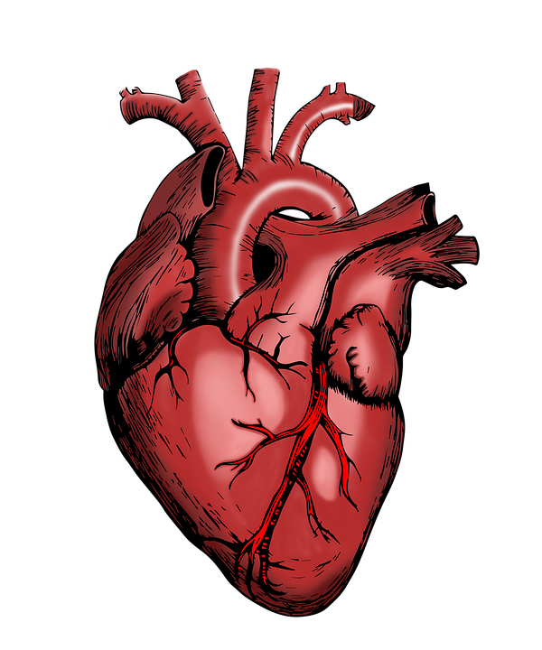

```{r setup, include=FALSE}
rm(list=ls())
library(lsr)
library(here)
library(dplyr)
library(shiny)
library(plotly)
library(markdown)
library(hrbrthemes)
library(highcharter)
library(flexdashboard)
library(DT)
options(shiny.maxRequestSize=300*1024^2)
```

```{r}
dta <- read.csv("heart_2020_cleaned.csv", dec=".", sep=",", stringsAsFactors = TRUE)

NumVar = list()
ChaVar = list()

for (x in names(dta)) {
  if(is.numeric(dta[[x]]) == TRUE){
    NumVar <- append(NumVar,x)
  }else{
      ChaVar <- append(ChaVar,x)
    }
}

NumVar <- unlist(NumVar)
ChaVar <- unlist(ChaVar)

rm(x)
```

# Corrélation {data-orientation="rows"}

## Sidebar {.sidebar}

```{r picture20, echo = F, out.width = '100%'}


```

```{r}
div(style = "font-size: 18px; font-weight: bold",
    selectInput(
      "race", "Race of people", unique(dta$Race),
       multiple = FALSE
      )
  )
```

```{r picture113, echo = F, out.width = '100%'}


```

```{r picture116, echo = F, out.width = '100%'}

```

```{r picture18, echo = F, out.width = '100%'}


```

## Value Boxes {data-width="200"}

### 

```{r}
renderValueBox({
  Val<-dta%>%
  dplyr::group_by(Race,HeartDisease, .drop = FALSE)%>%
  dplyr::summarise(nb=n())%>%
  dplyr::mutate(Prop=round((nb/sum(nb))*100,2))%>%
  dplyr::filter(HeartDisease=="Yes",Race==input$race)%>%
  dplyr::select(Prop)
  
  valueBox(paste(Val[["Prop"]],"%"),
           caption = div(style = "font-size: 28px; font-family: Times New Roman, serif;font-weight: bold",
                         tags$p("heart disease: Yes")),
           icon = "fa-globe")
})
```

### Health status : Very good

```{r}
renderGauge({
  Vg<-dta%>%
    dplyr::filter(Race==input$race)%>%
    dplyr::group_by(GenHealth)%>%
    dplyr::summarise(nb=n())%>%
    dplyr::mutate(Prop=round((nb/sum(nb))*100,2))%>%
    dplyr::select(GenHealth,Prop)%>%
    dplyr::filter(GenHealth=="Very good")%>%
    dplyr::select(Prop)
  
  gauge(
    Vg[[1]], min = 0, max = 100, symbol = '%', 
    sectors = gaugeSectors(
      danger = c(0, 20),
      warning = c(20, 80),
      success = c(80, 100)
    )
  )
})
```

### Health status : Good

```{r}
renderGauge({
  Gd<-dta%>%
  dplyr::filter(Race==input$race)%>%
  dplyr::group_by(GenHealth)%>%
  dplyr::summarise(nb=n())%>%
  dplyr::mutate(Prop=round((nb/sum(nb))*100,2))%>%
  dplyr::select(GenHealth,Prop)%>%
  dplyr::filter(GenHealth=="Good")%>%
  dplyr::select(Prop)
  
  gauge(
    Gd[[1]], min = 0, max = 100, symbol = '%', 
    sectors = gaugeSectors(
      danger = c(0, 20),
      warning = c(20, 80),
      success = c(80, 100)
    )
  )
})
```

### Health status : Excellent

```{r}
renderGauge({
  Ex<-dta%>%
  dplyr::filter(Race=="Black")%>%
  dplyr::group_by(GenHealth)%>%
  dplyr::summarise(nb=n())%>%
  dplyr::mutate(Prop=round((nb/sum(nb))*100,2))%>%
  dplyr::select(GenHealth,Prop)%>%
  dplyr::filter(GenHealth=="Excellent")%>%
  dplyr::select(Prop)
  
  gauge(
    Ex[[1]], min = 0, max = 100, symbol = '%', 
    sectors = gaugeSectors(
      danger = c(0, 20),
      warning = c(20, 80),
      success = c(80, 100)
    )
  )
})
```

### Health status : Fair

```{r}
renderGauge({
  Fa<-dta%>%
  dplyr::filter(Race==input$race)%>%
  dplyr::group_by(GenHealth)%>%
  dplyr::summarise(nb=n())%>%
  dplyr::mutate(Prop=round((nb/sum(nb))*100,2))%>%
  dplyr::select(GenHealth,Prop)%>%
  dplyr::filter(GenHealth=="Fair")%>%
  dplyr::select(Prop)
  
  gauge(
    Fa[[1]], min = 0, max = 100, symbol = '%', 
    sectors = gaugeSectors(
      danger = c(0, 20),
      warning = c(20, 80),
      success = c(80, 100)
    )
  )
})
```

### Health status : Poor

```{r}
renderGauge({
  Po<-dta%>%
  dplyr::filter(Race=="Black")%>%
  dplyr::group_by(GenHealth)%>%
  dplyr::summarise(nb=n())%>%
  dplyr::mutate(Prop=round((nb/sum(nb))*100,2))%>%
  dplyr::select(GenHealth,Prop)%>%
  dplyr::filter(GenHealth=="Poor")%>%
  dplyr::select(Prop)
  
  gauge(
    Po[[1]], min = 0, max = 100, symbol = '%', 
    sectors = gaugeSectors(
      danger = c(0, 20),
      warning = c(20, 80),
      success = c(80, 100)
    )
  )
})
```

## row (data-width = 600)

```{r}
Maladies <- list("Smoking","AlcoholDrinking","Stroke","Diabetic","Asthma","KidneyDisease","SkinCancer")
names(Maladies) <- Maladies

```

### Maladies en lien avec la maladie du coeur

```{r}
renderHighchart({
  Test <- function(x){
  dta%>%
    dplyr::filter(Race==input$race)%>%
    dplyr::select(HeartDisease,{{x}})%>%
    table()%>%
    cramersV()%>%
    round(2)
  }
  
  data.frame(Name=names(lapply(Maladies, Test)),
             val=unlist(lapply(Maladies, Test)))%>%
    arrange(desc(val)) %>%
    hchart("lollipop",hcaes(x=Name, y=val), name = "V_Cramer")%>%
    hc_chart(inverted=T)%>%
    hc_xAxis(title = list(text = ""),
             style = list(fontSize = "25px",
                          fontWeight = "bold"),
             labels = list(style = list(fontSize = "1.5vh"))) %>%
    hc_yAxis(title = list(text = "V cramer",
                          style = list(fontSize = "14px",
                                       fontWeight = "bold")))
  })
```

### Nombre de malade par categorie d'age

```{r}
renderHighchart({
  dta%>%
    filter(HeartDisease=="Yes",Race==input$race)%>%
    group_by(AgeCategory)%>%
    summarise(nb = n())%>%
    hchart("line", hcaes(x = AgeCategory, y = nb),
           name="HeartDisease")
})
```

### Nombre de malade par genre

```{r}
renderHighchart({
  dta%>%
    dplyr::filter(Race==input$race,HeartDisease=="Yes")%>%  
    dplyr::group_by(Sex)%>%
    summarise(nb=n())%>%
    mutate(prop=round((nb/sum(nb))*100,2))%>%
    hchart("pie",hcaes(x=Sex,y=prop),
           name="sick rate")
})
```

## row (data-width = 600)

### Temps de sommeil des malades

```{r}
renderHighchart({
  dta %>%
    dplyr::filter(Race==input$race,HeartDisease=="Yes")%>%
    dplyr::group_by(SleepTime)%>%
    dplyr::summarise(nb=n())%>%
    hchart("line", hcaes(x = SleepTime, y = nb),
           name="SleepTime")
})
```

### Les maladies les plus frequentes

```{r}
renderHighchart({
  Count <- function(x){
    dta%>%
      dplyr::filter(Race==input$race,dta[[x]]=="Yes")%>%
      dplyr::select({{x}})%>%
      nrow()
  }
  
  Nb<-dta%>%
    dplyr::filter(Race==input$race)%>%
    dplyr::group_by(Race)%>%
    dplyr::summarise(nb=n())%>%
    dplyr::select(nb)
  
  
  dta2<-data.frame(maladie = c(rep("Smoking",lapply(Maladies, Count)[["Smoking"]]),
                               rep("AlcoholDrinking",lapply(Maladies, Count)[["AlcoholDrinking"]]),
                               rep("Stroke",lapply(Maladies, Count)[["Stroke"]]),
                               rep("Diabetic",lapply(Maladies, Count)[["Diabetic"]]),
                               rep("Asthma",lapply(Maladies, Count)[["Asthma"]]),
                               rep("KidneyDisease",lapply(Maladies, Count)[["KidneyDisease"]]),
                               rep("SkinCancer",lapply(Maladies, Count)[["SkinCancer"]])))
  
  dta2%>%
    dplyr::group_by(maladie)%>%
    dplyr::summarise(nb=n())%>%
    dplyr::mutate(Prop=round((nb/Nb[[1]])*100,2))%>%
    arrange(desc(Prop)) %>%
    hchart('bar',
           hcaes(x = maladie, y = Prop),
           color = "orange", borderColor = "black",
           name = "sick rate")%>%
    hc_xAxis(title = list(text = ""),
             style = list(fontSize = "25px",
                          fontWeight = "bold"),
             labels = list(style = list(fontSize = "1.5vh")))
})
```

### Pratique de l'activite physique

```{r}
renderHighchart({
  dta%>%
    dplyr::filter(Race==input$race)%>%
    dplyr::group_by(PhysicalActivity,HeartDisease)%>%
    dplyr::summarise(nb=n())%>%
    hchart(type="column", hcaes(x="PhysicalActivity",y="nb",group="HeartDisease"))
})
```

# Mode_de_vie {data-orientation="columns"}

## Sidebar {.sidebar}

```{r picture02, echo = F, out.width = '100%'}


```

```{r picture13, echo = F, out.width = '100%'}


```

```{r}
div(style = "font-size: 18px; font-weight: bold",
    selectInput(
      "HeartD", "Heart Disease", unique(dta$HeartDisease),
       multiple = FALSE
      )
  )
```

```{r}
div(style = "font-size: 18px; font-weight: bold",
    selectInput(
      "Smok", "Smoking", unique(dta$Smoking),
       multiple = FALSE
      )
  )
```

```{r}
div(style = "font-size: 18px; font-weight: bold",
    selectInput(
      "Alco", "Alcohol Drinking", unique(dta$AlcoholDrinking),
       multiple = FALSE
      )
  )
```

```{r}
div(style = "font-size: 18px; font-weight: bold",
    selectInput(
      "Stro", "Stroke", unique(dta$Stroke),
       multiple = FALSE
      )
  )
```

```{r}
div(style = "font-size: 18px; font-weight: bold",
    selectInput(
      "Diff", "DiffWalking", unique(dta$DiffWalking),
       multiple = FALSE
      )
  )
```

```{r}
div(style = "font-size: 18px; font-weight: bold",
    selectInput(
      "Diab", "Diabetic", unique(dta$Diabetic),
       multiple = FALSE
      )
  )
```

```{r}
div(style = "font-size: 18px; font-weight: bold",
    selectInput(
      "Ast", "Asthma", unique(dta$Asthma),
       multiple = FALSE
      )
  )
```

```{r}
div(style = "font-size: 18px; font-weight: bold",
    selectInput(
      "Kid", "Kidney Disease", unique(dta$KidneyDisease),
       multiple = FALSE
      )
  )
```

```{r}
div(style = "font-size: 18px; font-weight: bold",
    selectInput(
      "Ski", "Skin Cancer", unique(dta$SkinCancer),
       multiple = FALSE
      )
  )
```

## Column {data-width="650"}

### Indicateur physique et mentale

```{r}
renderPlotly({
    dta1<-dta%>%
      dplyr::filter(HeartDisease==input$HeartD,Smoking==input$Smok,AlcoholDrinking==input$Alco,
                    Stroke==input$Stro,DiffWalking==input$Diff,Diabetic==input$Diab,
                    Asthma==input$Ast,KidneyDisease==input$Kid,SkinCancer==input$Ski)%>%
      dplyr::group_by(AgeCategory)%>%
      dplyr::summarise(Physical = round(mean(PhysicalHealth),2),
                       Mental = round(mean(MentalHealth),2),
                       Sleep = round(mean(SleepTime),2))
      ggplot(dta1)+
        geom_line(aes(x=AgeCategory,y=Physical,colour="Physical",group=1),size=1)+
        geom_line(data=dta1,aes(x=AgeCategory,y=Mental,colour="Mental",group=1),size=1)+
        geom_line(data=dta1,aes(x=AgeCategory,y=Sleep,colour="Sleep",group=1),size=1)+
        theme_ipsum()+
        scale_color_manual(name="Health",
                           values=c("Physical"="darkred",
                                    "Mental"="steelblue",
                                    "Sleep"="#1EE611"))
})
```

### Nombre de malade par catégorie d'âge

```{r}
renderHighchart({
  dta%>%
    dplyr::filter(HeartDisease==input$HeartD,Smoking==input$Smok,AlcoholDrinking==input$Alco,
                  Stroke==input$Stro,DiffWalking==input$Diff,Diabetic==input$Diab,
                  Asthma==input$Ast,KidneyDisease==input$Kid,SkinCancer==input$Ski)%>%
    dplyr::group_by(AgeCategory)%>%
    dplyr::summarise(nb=n())%>%
    arrange(desc(nb))%>%
    hchart('bar',
           hcaes(x = AgeCategory, y = nb),
           color = "orange", borderColor = "black",
           name = "Count")%>%
    hc_xAxis(title = list(text = "Age Category"),
             style = list(fontSize = "25px",
                          fontWeight = "bold"),
             labels = list(style = list(fontSize = "1.5vh")))
})
```

## Column {data-width="350"}

### Indice corporel moyen

```{r}
renderGauge({
  Wd<-dta%>%
    dplyr::filter(HeartDisease==input$HeartD,Smoking==input$Smok,AlcoholDrinking==input$Alco,
                  Stroke==input$Stro,DiffWalking==input$Diff,Diabetic==input$Diab,
                  Asthma==input$Ast,KidneyDisease==input$Kid,SkinCancer==input$Ski)
  
  gauge(
    round(mean(Wd$BMI),2), min = 18, max = 80, symbol = 'BMI',
    sectors = gaugeSectors(
       success = c(18, 25),
       warning = c(30, 39.5),
      danger = c(40, 80)
      ,
     
      )
    )
  })
```

### Temps de sommeil par âge

```{r}
renderHighchart({
  dta1 <- dta%>%
    dplyr::filter(HeartDisease==input$HeartD,Smoking==input$Smok,AlcoholDrinking==input$Alco,
                  Stroke==input$Stro,DiffWalking==input$Diff,Diabetic==input$Diab,
                  Asthma==input$Ast,KidneyDisease==input$Kid,SkinCancer==input$Ski)%>%
    dplyr::group_by(SleepTime)%>%
    dplyr::summarise(nb=n())
  
  if(nrow(dta1) > 1){
    dta1%>%
      hchart("line", hcaes(x = SleepTime, y = nb),
             name="SleepTime")}
  })

renderText({
  dta1 <- dta%>%
    dplyr::filter(HeartDisease==input$HeartD,Smoking==input$Smok,AlcoholDrinking==input$Alco,
                  Stroke==input$Stro,DiffWalking==input$Diff,Diabetic==input$Diab,
                  Asthma==input$Ast,KidneyDisease==input$Kid,SkinCancer==input$Ski)%>%
    dplyr::group_by(SleepTime)%>%
    dplyr::summarise(nb=n())
  
  if(nrow(dta1)<=1){
    "Please select a data set"
  }
})

```

### Activité physique

```{r}
renderHighchart({
  dta%>%
    dplyr::filter(HeartDisease==input$HeartD,Smoking==input$Smok,AlcoholDrinking==input$Alco,
                  Stroke==input$Stro,DiffWalking==input$Diff,Diabetic==input$Diab,
                  Asthma==input$Ast,KidneyDisease==input$Kid,SkinCancer==input$Ski)%>%
    dplyr::group_by(PhysicalActivity)%>%
    dplyr::summarise(nb=n())%>%
    hchart(type="column", hcaes(x="PhysicalActivity",y="nb"),
           name="Nb of pratics")
})
```

# Maladie_Race_Genre_Age {data-orientation="rows"}

## Sidebar {.sidebar}

```{r picture011, echo = F, out.width = '100%'}


```

```{r picture44, echo = F, out.width = '100%'}


```

```{r}
div(style = "font-size: 18px; font-weight: bold, color: #4d3a7d;", 
    selectInput(
      "races", "La Race", unique(dta$Race),
       multiple = FALSE
      )
  )
```

```{r picture9, echo = F, out.width = '100%'}

```

```{r}
div(style = "font-size: 18px; font-weight: bold, color: #4d3a7d;", 
    selectInput(
      "genre", "Le Genre", unique(dta$Sex),
       multiple = FALSE
      )
  )
```

```{r picture10, echo = F, out.width = '100%'}

```

```{r}
div(style = "font-size: 18px; font-weight: bold, color: #4d3a7d;", 
    selectInput(
      "age", "La Catégorie_âge", unique(dta$AgeCategory),
       multiple = FALSE
      )
  )
```

```{r picture11, echo = F, out.width = '100%'}

```

```{r picture14, echo = F, out.width = '100%'}


```

## Rows {data-width="650"}

### L'état de santé générale en fonction du temps de sommeil et de santé physique

```{r}
renderHighchart({
  dta1 <- dta %>%
    dplyr::filter(AgeCategory==input$age,Sex==input$genre,Race==input$races)%>%
    dplyr::group_by(GenHealth)%>%
    dplyr::summarise(nb=n(),
                     Physical_Health=round(mean(PhysicalHealth),2),
                     Sleep_Time=round(mean(SleepTime),2))%>%
    dplyr::mutate(percent=round((nb/sum(nb))*100,2))
  
  hchart(dta1, "bubble", hcaes(x = Sleep_Time, 
                               y =Physical_Health , 
                               size = GenHealth , 
                               color = percent),
         name = "GenHealth",
         maxSize = "10%")
})


```

### L'évolution de l'état de santé générale en fonction de la santé mentale et physique.

```{r}
renderHighchart({
  dta1 <- dta %>%
    dplyr::filter(AgeCategory==input$age,Sex==input$genre,Race==input$races)%>%
    dplyr::group_by(GenHealth)%>%
    dplyr::summarise(nb=n(),
                     Physical_Health=round(mean(PhysicalHealth),2),
                     Mental_Health=round(mean(MentalHealth),2),)%>%
    dplyr::mutate(percent=round((nb/sum(nb))*100,2))
  
  hchart(dta1, "bubble", hcaes(x = Mental_Health, 
                               y = Physical_Health, 
                               size = GenHealth, 
                               color = percent),
         name = "GenHealth",
         maxSize = "10%")
})

```

## Rows {data-width="350"}

### Nombre de maladie par catégorie d'âge et par genre

```{r}
renderDT({
  dta1 <- dta %>%
    dplyr::filter(AgeCategory== input$age, Sex ==input$genre, Race== input$races)%>%
    dplyr::group_by(HeartDisease)%>%
    dplyr::summarise(total=n())%>%
    dplyr::mutate(moyenne=round((total/sum(total))*100,2))         
    
  
  datatable(dta1,
            options = list(paging = TRUE,    ## paginate the output
                 pageLength = 5,  ## number of rows to output for each page
                style = "default", # Applique un autre style
                class = "display" # classe CSS de la table
                 )
          
                
)
  
 
}
)
```

### L'état de santé générale en fonction du temps de sommeil et de santé de mentale

```{r}
renderHighchart({
  dta1 <- dta %>%
    dplyr::filter(AgeCategory==input$age,Sex==input$genre,Race==input$races)%>%
    dplyr::group_by(GenHealth)%>%
    dplyr::summarise(nb=n(),
                     Mental_Health=round(mean( MentalHealth),2),
                     Sleep_Time=round(mean(SleepTime),2))%>%
    dplyr::mutate(percent=round((nb/sum(nb))*100,2))
  
  hchart(dta1, "bubble", hcaes(x = Sleep_Time, 
                               y = Mental_Health , 
                               size = GenHealth , 
                               color = percent),
         name = "GenHealth",
         maxSize = "10%")
})

```
